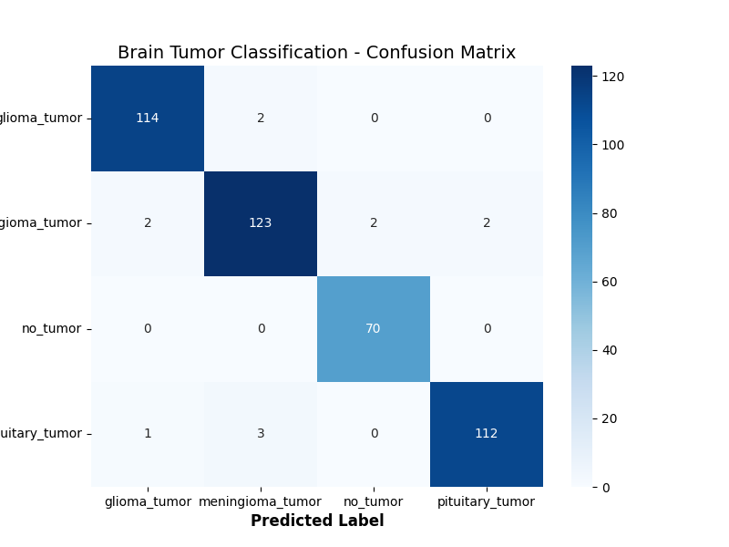

# 🧠 Brain Tumor MRI Classifier: End-to-End Deep Learning Pipeline
[](https://brain-tumor-classifier-cv.streamlit.app/)
[](https://www.python.org/downloads/)
[](https://pytorch.org/)

## 📌 Project Overview

This project is an end-to-end machine learning operations (MLOps) pipeline that classifies brain tumors from MRI scans. Built as a proof-of-concept for deploying medical imaging models in constrained compute environments, it demonstrates the full lifecycle of a deep learning project—from data ingestion and transfer learning to cloud deployment and interactive web inference.

> **Note:** This is an educational prototype and portfolio project. It is **NOT** intended for clinical diagnostic use.

## 🚀 Live Demo

**[Test the application live on Streamlit Community Cloud](https://brain-tumor-classifier-cv.streamlit.app/)**

## 🚀 Key Features

- **Transfer Learning Engine:** Utilizes a fine-tuned ResNet50 architecture to achieve high recall on tumor classification despite a limited training dataset.
- **Robust Data Pipeline:** Engineered to bypass Google Colab runtime constraints using persistent Drive checkpointing and fast local-storage extraction.
- **Cloud-Native Inference:** Deployed via Streamlit Community Cloud.
- **Decoupled Architecture:** Model weights are stored externally (via Google Drive and `gdown`) to keep the GitHub repository lightweight and adhere to standard Git LFS alternatives.

## 📊 Dataset

The model was trained on the [Brain Tumor Classification (MRI)](https://www.kaggle.com/datasets/sartajbhuvaji/brain-tumor-classification-mri) dataset sourced from Kaggle.

- **Total Images:** ~3,264
- **Classes:** Glioma, Meningioma, Pituitary Tumor, and No Tumor.
- **Preprocessing:** Images resized to 224x224, normalized to ImageNet standards, and augmented with random horizontal flips and rotations to prevent overfitting.

## 📈 Model Evaluation & Results

The model's primary evaluation metric is **Recall (Sensitivity)**, as minimizing False Negatives is the most critical constraint in medical imaging contexts.



- **Best Validation Accuracy:** 97.45
- **Optimizer:** Adam (lr=0.0001)
- **Loss Function:** CrossEntropyLoss

## 📂 Repository Structure

```
brain-tumor-classification-cv/
│
├── notebooks/                  # Colab notebooks for EDA, Training, and Evaluation
│   ├── 01_data_exploration.ipynb
│   ├── 02_model_training.ipynb
│   └── 03_evaluation.ipynb
│
├── app.py                      # Main Streamlit web application script
├── requirements.txt            # Python dependencies (includes gdown for model retrieval)
└── README.md                   # Project documentation
```

## 💻 How to Run Locally

If you want to run this application on your local machine, follow these steps:

### 1. Clone the repository

```bash
git clone [https://github.com/[Your-Username]/brain-tumor-classification-cv.git](https://github.com/muhammadabdurrehmanmaqsood/brain-tumor-classifier)
cd brain-tumor-classifier
```

### 2. Install dependencies

It is recommended to use a virtual environment.

```bash
pip install -r requirements.txt
```

### 3. Run the Streamlit App

```bash
streamlit run app.py
```

> **Note:** The first time you run the app, the `gdown` library will automatically download the 90MB `resnet50_best.pth` model weights file from cloud storage.

## 🔮 Future Work (Phase 2)

- **Multi-Modality:** Expand the data pipeline to ingest and classify CT scans (DICOM format) alongside MRI scans.
- **Modular Refactoring:** Transition core notebook logic (training loops, dataloaders) into modular Python scripts (`src/`) for production-grade CI/CD integration.
- **Explainable AI (XAI):** Integrate Grad-CAM to highlight the specific regions of the MRI scan that triggered the model's prediction.
